<!-- BANNER -->

<!-- TYPING ANIMATION — one clear, specific line -->

<!-- STATUS BADGES — purposeful, not decorative -->
 

  

<!-- SOCIAL LINKS -->

---

## &nbsp;Who I am

I'm a software developer who builds things that actually *do something.*

AI tools that parse meaning from raw text. Dashboards that make 15,000 rows of data readable at a glance. Backend systems designed to hold up when things get complicated. I work across the full stack — but I'm most at home in the logic layer, figuring out *why* something should work before writing a line of code.

MCA graduate from Panjab University. Currently open to full-time roles in backend, full-stack, or AI/ML engineering.

---

## &nbsp;What I work with

<table>
  <tr>
    <td><b>Languages</b></td>
    <td>
      
      
      
    </td>
  </tr>
  <tr>
    <td><b>Backend</b></td>
    <td>
      
      
    </td>
  </tr>
  <tr>
    <td><b>AI / ML</b></td>
    <td>
      
      
      
      
    </td>
  </tr>
  <tr>
    <td><b>Frontend</b></td>
    <td>
      
      
      
    </td>
  </tr>
  <tr>
    <td><b>Data</b></td>
    <td>
      
      
      
      
    </td>
  </tr>
  <tr>
    <td><b>Tools</b></td>
    <td>
      
      
      
      
    </td>
  </tr>
</table>

---

## &nbsp;Featured projects

 

### &nbsp;[🧠 TextLens AI](https://github.com/kaurharkirat24/TextLens_AI) &nbsp;—&nbsp; *AI · LangChain · Vector Search*

> Drop in raw text. Ask questions about it. Get real answers.

Built an end-to-end semantic search and Q&A platform using vector embeddings and LangChain. The interesting part wasn't the LLM — it was building the retrieval pipeline that feeds it the *right* context. Chunking strategy, embedding quality, and relevance scoring all matter more than most tutorials admit.

`Python` `LangChain` `NLP` `Vector Search` `Semantic Embeddings`

---

### &nbsp;[🎬 Whats-On-Netflix](https://github.com/kaurharkirat24/whats-on-netflix) &nbsp;—&nbsp; *Flask · Python · Data Viz*

> Netflix has 15,000+ titles. This makes sense of them.

Built a full analytics dashboard exploring genre trends, release patterns, country distributions, and rating breakdowns — with a UI designed to match the content. Because if you're analysing Netflix, the dashboard should *feel* like Netflix.

`Flask` `Python` `Matplotlib` `HTML` `CSS`

---

### &nbsp;[🌐 IgniteOne](https://github.com/kaurharkirat24/IgniteOne) &nbsp;—&nbsp; *Java · JSP · SQL*

> A fundraising platform built around transparency, not just transactions.

Designed the full donation flow from project discovery to contribution tracking, with a focus on making impact visible to donors. Java and JSP backend, SQL for persistent tracking, clean session handling throughout.

`Java` `JSP` `SQL` `Session Management`

---

## 📊 GitHub Stats

  

---

## 🤝 Connect With Me

  
  &nbsp;
  

---

  

  <em>✨ Thanks for visiting my profile! Let's connect and build something great together. ✨</em>

